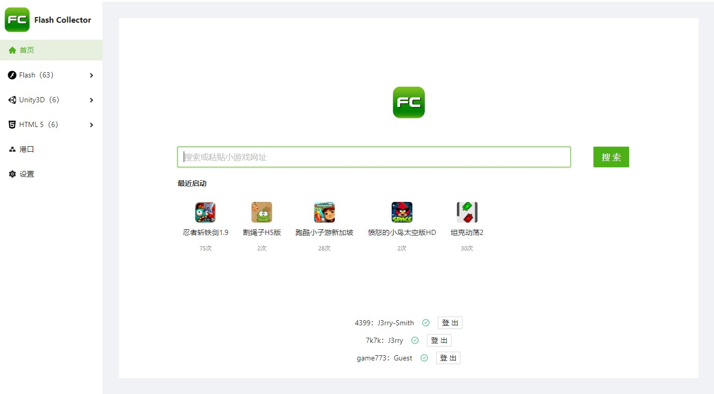

# Flash Collector （小游戏收集器）

小游戏收集器，一键下载、本地运行小游戏，希望能帮助你收集到来自童年的一份快乐

## 特性

- 一键解析下载 Flash 和 Unity3D Web 小游戏
- 智能嗅探技术，帮助下载复杂的异步加载 Flash 游戏（不保证完全可用）
- 在本地运行 Flash 和 Unity3D Web 小游戏
- 一键解析并保存 HTML5 小游戏真实页面
- 自动添加 Referer 绕过 HTML5 小游戏真实页面请求限制
- 登录站点自动获取 Cookie
- Referer / UA 请求仿真，避免触发站点反爬策略
- 自动检测并安装必要的运行库
- 模块化设计，可拓展小游戏站点支持
- 一键导入导出你的游戏库，与你的同伴共享游戏
- 进度备份/恢复/导出/导入功能，方便地在不同电脑之间同步进度（[1 issue needs help](https://github.com/Cnotech/flash-collector/issues/6)）

## 支持的站点

如果希望拓展站点支持请查看[拓展小游戏网站支持](#拓展小游戏网站支持)。不接受站点支持添加请求，请自己动手添加支持然后提交 PR，谢谢！

- [4399](http://www.4399.com) by [@Cnotech](https://github.com/Cnotech)
- [7k7k](http://www.7k7k.com) by [@Cnotech](https://github.com/Cnotech)
- [game773](https://www.game773.com) by [@Cnotech](https://github.com/Cnotech)
- [17yy](http://www.17yy.com) by [@dsy4567](https://github.com/dsy4567)
- [7724](https://www.7724.com/new.html) by [@dsy4567](https://github.com/dsy4567)

## 下载

访问 [Releases](https://github.com/Cnotech/flash-collector/releases) 或 [境内发布服务器](https://pineapple.edgeless.top/FC/)。

## 配套用户脚本

由于 4399 为真实游戏页面增加了 Referer 限制，因此无法直接在浏览器中访问源站真实页面播放游戏，需要配合油猴或暴力猴插件安装配套用户脚本；此脚本还可以修改源站播放的网页标题、撑开原生 Flash 游戏文件元素。

GreasyFork : https://greasyfork.org/zh-CN/scripts/444989-flash-collector-script

如果在 GreasyFork 上的脚本被举报删除，请在本仓库的 `user-script`
目录获取脚本或直接[点击此链接安装](https://github.com/Cnotech/flash-collector/raw/master/user-script/flash-collector-script.user.js)。

## 浏览器兼容性

Flash Collector 在本地运行游戏可能需要浏览器的支持，Flash 游戏的“兼容模式”（点击“开始游戏”会调用自带的 Flash 独立播放器，不需要浏览器支持）和 Unity3D 游戏需要在浏览器中运行，因此需要浏览器对这两个插件的支持。

目前国际主流的浏览器基本都取消了对 Flash 插件的支持，也顺便误伤了 Unity3D Web 插件，仅有国内的几家浏览器厂商会增加对这两种插件的支持。

下面给出浏览器兼容性测试表（按照推荐顺序排序），测试时间为 2022-05-17，测试环境运行 Windows 10 企业版 64 位，浏览器安装包均从官网下载最新稳定版。

几款主流国际浏览器因为全军覆没因此没有出现在表格中：`Chrome` `Edge (Chromium)` `Firefox` `傲游浏览器` `Opera` `IE11`
；2345 加速浏览器则因为其过于恶臭的名声（捏鼻）没有被加入测试名单。如果你知晓其他**最新版本**支持这两种插件的浏览器请新建 PR。

| 浏览器                           | Flash 纯净版 | Flash 毒瘤版 | Unity64 位 | Unity32 位                |
| -------------------------------- | ------------ | ------------ | ---------- | ------------------------- |
| 360 极速浏览器 X 64 位           | ✅           | ✅           | ✅         | ❌                        |
| 360 极速浏览器 32 位（停止维护） | ✅           | ✅           | ❌         | ✅                        |
| 搜狗高速浏览器                   | ✅           | ✅           | ❌         | ⭕️ 能显示 logo，无法加载 |
| 360 安全浏览器                   | ❌           | ✅           | ❌         | ✅                        |
| 百分浏览器                       | ✅           | ✅           | ❌         | ❌                        |
| QQ 浏览器                        | ✅           | ✅           | ❌         | ❌                        |
| 星愿浏览器                       | ❌           | ❌           | ❌         | ❌                        |

`360极速浏览器X 64位`是测试的浏览器中唯一支持 Unity 64 位的，并且同时支持 Flash 纯净版，这个浏览器也没有自带流氓捆绑，因此还是比较推荐的（真没收钱 xdm）；

> 2024-04-14 更新：实测最新版的 360 极速浏览器 X 64 位（22.1.1090.64）无法正常处理 Unity 的键盘输入，推荐大家用 360 极速浏览器 32 位或者自己找旧版 Chrome 吧，备份了一个 360 极速浏览器的安装包在仓库的 bin 目录下

`360极速浏览器 32位`也不错，同样不自带流氓捆绑。不过由于 360 极速产品线开始全面转向 64 位，32 位停止维护了，因此最好还是用 64 位的最新版本；

`搜狗高速浏览器`是 4399 官方推荐的两大浏览器之一，不过测试时所有 Unity 游戏都一直卡在 Unity logo 无法进入，暂不清楚是通病还是个例；

`360安全浏览器`只能识别 Flash 毒瘤版的安装目录然后基于此 Flash 启动安全沙箱，因此不支持 Flash 纯净版。而且这个浏览器本身捆绑比较多，不怎么推荐；

`百分浏览器`、`QQ浏览器`不支持 Unity 不太推荐，除非你只玩 Flash 小游戏；

`星愿浏览器`可能是因为人手不够加上产品定位的问题，没有加入对这两种插件的适配修改。

Flash Collector 支持大部分主流浏览器的识别。你也可以使用旧版的 Chrome 或 Firefox，然后在“设置”页面自定义启动浏览器路径。

## 关于登录

解析与下载功能需要登录对应的网站，可以不实名制认证。

登录功能仅用于在爬取页面和下载游戏时向站点发送有效 cookie，你的游戏进度不能被保存到本地。

## 关于 17yy 功勋值

部分 17yy 小游戏需要一定的功勋值，目前还没有办法绕过此限制。

## 反馈

如果遇到无法解析或解析为 HTML5 的 Flash 或 Unity3D
游戏请 [新建反馈 issue](https://github.com/Cnotech/flash-collector/issues/new?assignees=Cnotech&labels=&template=unsolvable.yml&title=%5Bunsolvable%5D%3A+)
，不接受 HTML5
或页游的反馈请求。

如果无法在本地正常运行 Flash 小游戏或是无法使用“源站播放”功能，请**仔细阅读“开始游戏”按钮右侧问号图标内的内容**。

## 拓展小游戏网站支持

定位到 `./packages/main/modules`，编写一个实现了 `ParserRegister` 接口的站点模块，然后在 `_register.ts` 中注册你的模块。

`ParserRegister` 接口的相关注释位于 `packages/class.ts`，尽量参考现有模块的实现。

我们推荐为你的模块增加单元测试文件 `MODULE_NAME.test.ts` 以便确保后续项目变动时你的模块能够正常工作。

## 调试

执行 `yarn dev`。

## 单元测试

执行 `yarn test`。

## 编译

执行 `yarn build`。

> Flash Collector 仅支持在 Windows 64 位系统上编译和运行

## 条款

使用此软件及其相关内容即表示您同意下述条款：

1. 该仓库的代码以及编译后的可执行文件（包括发布的软件）仅供个人交流学习使用，作者不对以任何形式使用这些代码或可执行文件造成的后果负责；
2. 禁止任何个人或组织将此软件及其相关内容用作商业用途，使用开源代码时必须严格遵守 MPL-2.0 协议；
3. 本软件及其仓库是 Flash Collector 字样及下图所示图标（渐变绿底 FC 字）的最早使用者，任何个人或组织不得未经授权使用相关字样或图标。

    

